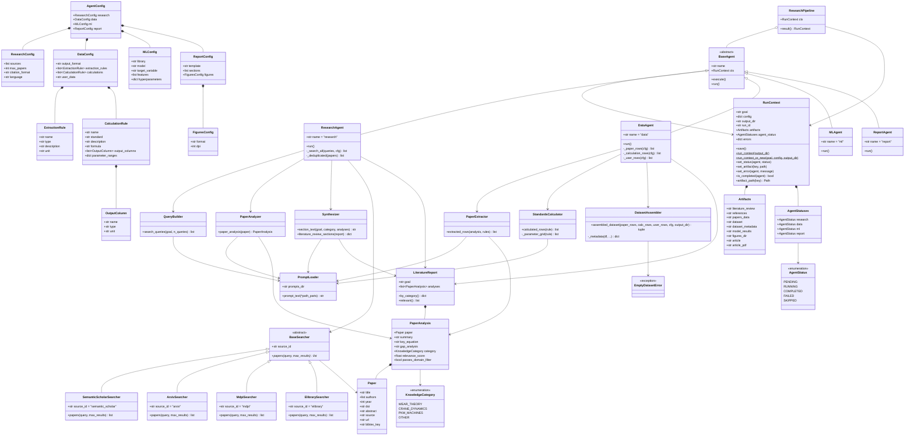

# Class Diagram — Research Agents

```mermaid
classDiagram

    %% ─────────────────────────────────────────
    %% CORE
    %% ─────────────────────────────────────────

    class RunContext {
        +str goal
        +dict config
        +str output_dir
        +str run_id
        +Artifacts artifacts
        +AgentStatuses agent_status
        +dict errors
        +save()
        +run_context(output_dir)$
        +run_context_or_new(goal, config, output_dir)$
        +set_status(agent, status)
        +set_artifact(key, path)
        +set_error(agent, message)
        +is_completed(agent) bool
        +artifact_path(key) Path
    }

    class Artifacts {
        +str literature_review
        +str references
        +str papers_data
        +str dataset
        +str dataset_metadata
        +str model_results
        +str figures_dir
        +str article
        +str article_pdf
    }

    class AgentStatuses {
        +AgentStatus research
        +AgentStatus data
        +AgentStatus ml
        +AgentStatus report
    }

    class AgentStatus {
        <<enumeration>>
        PENDING
        RUNNING
        COMPLETED
        FAILED
        SKIPPED
    }

    RunContext *-- Artifacts
    RunContext *-- AgentStatuses
    AgentStatuses --> AgentStatus

    %% ─────────────────────────────────────────
    %% CONFIG
    %% ─────────────────────────────────────────

    class AgentConfig {
        +ResearchConfig research
        +DataConfig data
        +MLConfig ml
        +ReportConfig report
    }

    class ResearchConfig {
        +list sources
        +int max_papers
        +str citation_format
        +str language
    }

    class DataConfig {
        +str output_format
        +list~ExtractionRule~ extraction_rules
        +list~CalculationRule~ calculations
        +str user_data
    }

    class ExtractionRule {
        +str name
        +str type
        +str description
        +str unit
    }

    class CalculationRule {
        +str name
        +str standard
        +str description
        +str formula
        +list~OutputColumn~ output_columns
        +dict parameter_ranges
    }

    class OutputColumn {
        +str name
        +str type
        +str unit
    }

    class MLConfig {
        +str library
        +str model
        +str target_variable
        +list features
        +dict hyperparameters
    }

    class ReportConfig {
        +str template
        +list sections
        +FiguresConfig figures
    }

    class FiguresConfig {
        +str format
        +int dpi
    }

    AgentConfig *-- ResearchConfig
    AgentConfig *-- DataConfig
    AgentConfig *-- MLConfig
    AgentConfig *-- ReportConfig
    ReportConfig *-- FiguresConfig
    DataConfig *-- ExtractionRule
    DataConfig *-- CalculationRule
    CalculationRule *-- OutputColumn

    %% ─────────────────────────────────────────
    %% PIPELINE & AGENTS
    %% ─────────────────────────────────────────

    class ResearchPipeline {
        +RunContext ctx
        +result() RunContext
    }

    class BaseAgent {
        <<abstract>>
        +str name
        +RunContext ctx
        +execute()
        +run()*
    }

    class ResearchAgent {
        +str name = "research"
        +run()
        -_search_all(queries, cfg) list
        -_deduplicated(papers) list
    }

    class DataAgent {
        +str name = "data"
        +run()
        -_paper_rows(cfg) list
        -_calculation_rows(cfg) list
        -_user_rows(cfg) list
    }

    class MLAgent {
        +str name = "ml"
        +run()
    }

    class ReportAgent {
        +str name = "report"
        +run()
    }

    ResearchPipeline o-- BaseAgent
    ResearchPipeline --> RunContext
    BaseAgent --> RunContext
    BaseAgent <|-- ResearchAgent
    BaseAgent <|-- DataAgent
    BaseAgent <|-- MLAgent
    BaseAgent <|-- ReportAgent

    %% ─────────────────────────────────────────
    %% RESEARCH AGENT COMPONENTS
    %% ─────────────────────────────────────────

    class PromptLoader {
        +str prompts_dir
        +prompt_text(*path_parts) str
    }

    class QueryBuilder {
        +search_queries(goal, n_queries) list
    }

    class PaperAnalyzer {
        +paper_analysis(paper) PaperAnalysis
    }

    class Synthesizer {
        +section_text(goal, category, analyses) str
        +literature_review_sections(report) dict
    }

    class BaseSearcher {
        <<abstract>>
        +str source_id
        +papers(query, max_results)* list
    }

    class SemanticScholarSearcher {
        +str source_id = "semantic_scholar"
        +papers(query, max_results) list
    }

    class ArxivSearcher {
        +str source_id = "arxiv"
        +papers(query, max_results) list
    }

    class MdpiSearcher {
        +str source_id = "mdpi"
        +papers(query, max_results) list
    }

    class ElibrarySearcher {
        +str source_id = "elibrary"
        +papers(query, max_results) list
    }

    ResearchAgent --> QueryBuilder
    ResearchAgent --> PaperAnalyzer
    ResearchAgent --> Synthesizer
    ResearchAgent --> BaseSearcher
    QueryBuilder --> PromptLoader
    PaperAnalyzer --> PromptLoader
    Synthesizer --> PromptLoader
    BaseSearcher <|-- SemanticScholarSearcher
    BaseSearcher <|-- ArxivSearcher
    BaseSearcher <|-- MdpiSearcher
    BaseSearcher <|-- ElibrarySearcher

    %% ─────────────────────────────────────────
    %% DATA AGENT COMPONENTS
    %% ─────────────────────────────────────────

    class PaperExtractor {
        +extracted_rows(analysis, rules) list
    }

    class StandardsCalculator {
        +calculated_rows(rule) list
        -_parameter_grid(rule) list
    }

    class DatasetAssembler {
        +assembled_dataset(paper_rows, calc_rows, user_rows, cfg, output_dir) tuple
        -_metadata(df, ...) dict
    }

    class EmptyDatasetError {
        <<exception>>
    }

    DataAgent --> PaperExtractor
    DataAgent --> StandardsCalculator
    DataAgent --> DatasetAssembler
    DataAgent --> LiteratureReport
    PaperExtractor --> PromptLoader
    StandardsCalculator --> PromptLoader
    DatasetAssembler --> EmptyDatasetError

    %% ─────────────────────────────────────────
    %% RESEARCH MODELS
    %% ─────────────────────────────────────────

    class Paper {
        +str title
        +list authors
        +int year
        +str doi
        +str abstract
        +str source
        +str url
        +str bibtex_key
    }

    class PaperAnalysis {
        +Paper paper
        +str summary
        +str key_equation
        +str gap_analysis
        +KnowledgeCategory category
        +float relevance_score
        +bool passes_domain_filter
    }

    class LiteratureReport {
        +str goal
        +list~PaperAnalysis~ analyses
        +by_category() dict
        +relevant() list
    }

    class KnowledgeCategory {
        <<enumeration>>
        WEAR_THEORY
        CRANE_DYNAMICS
        PKM_MACHINES
        OTHER
    }

    PaperAnalysis *-- Paper
    PaperAnalysis --> KnowledgeCategory
    LiteratureReport *-- PaperAnalysis
    ResearchAgent --> LiteratureReport
    BaseSearcher --> Paper
    PaperAnalyzer --> PaperAnalysis
    Synthesizer --> LiteratureReport
    PaperExtractor --> PaperAnalysis
```
